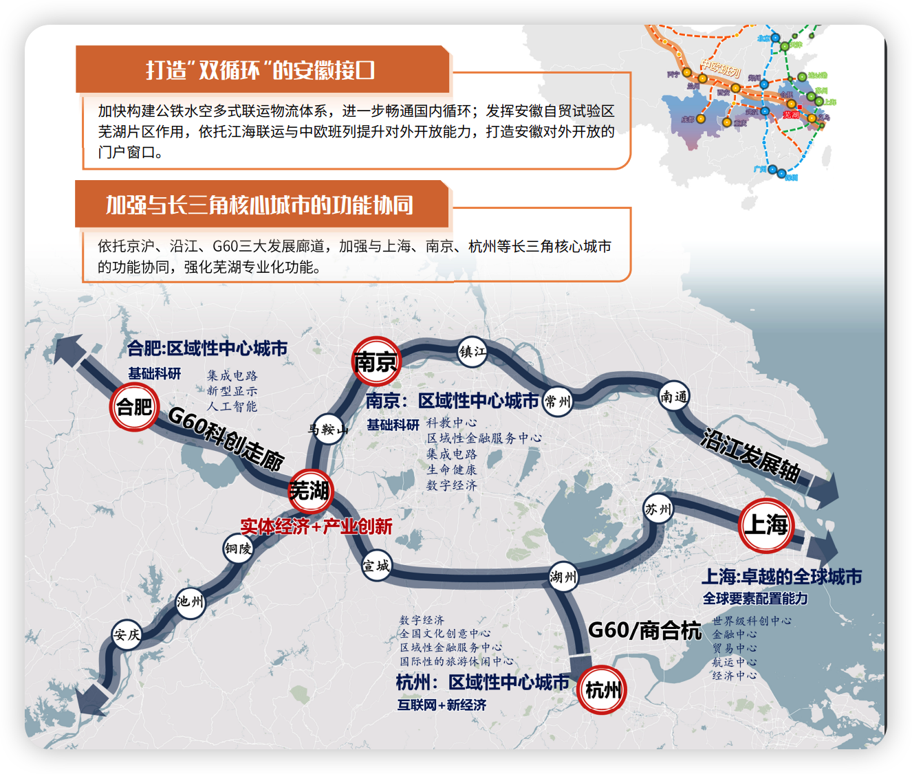
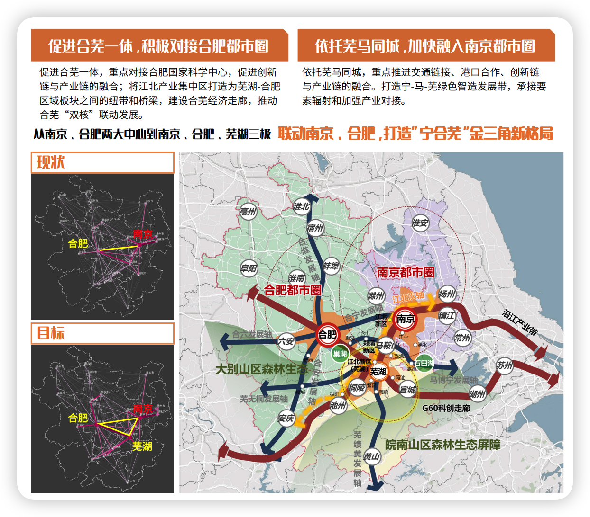
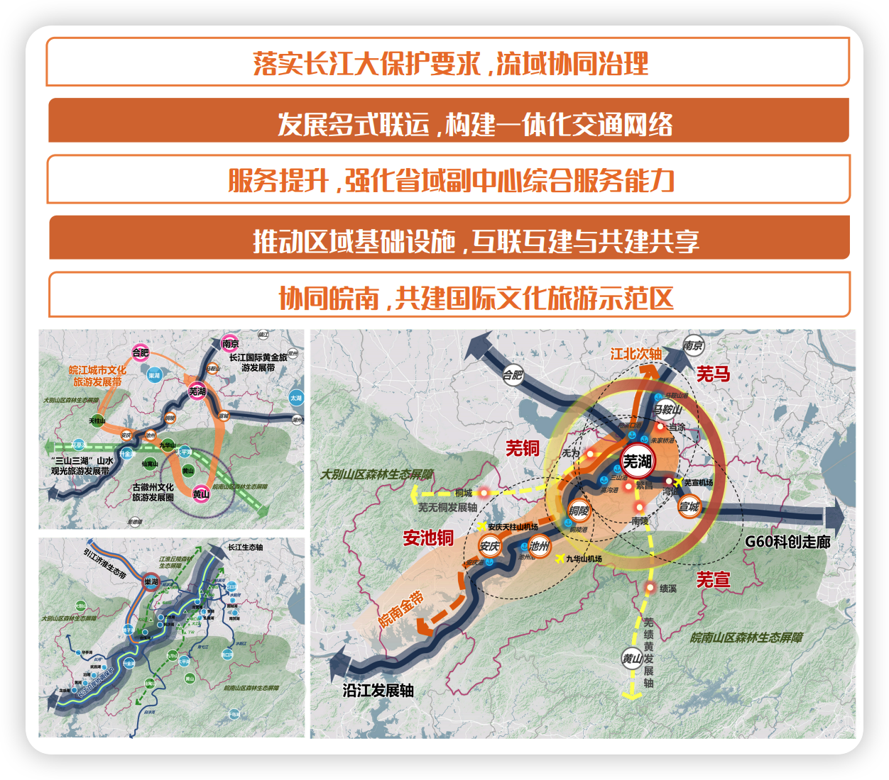
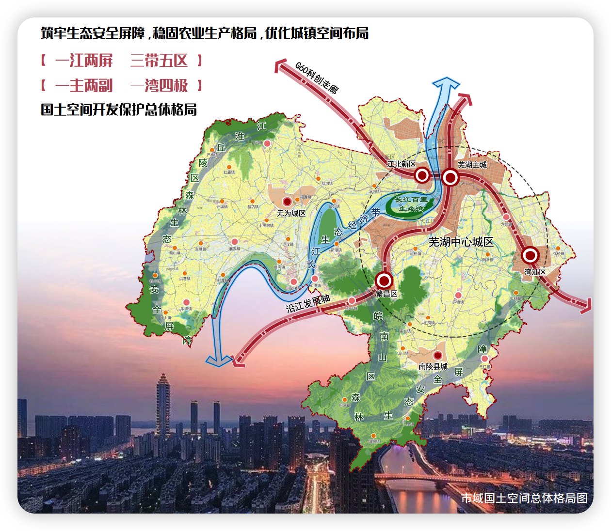
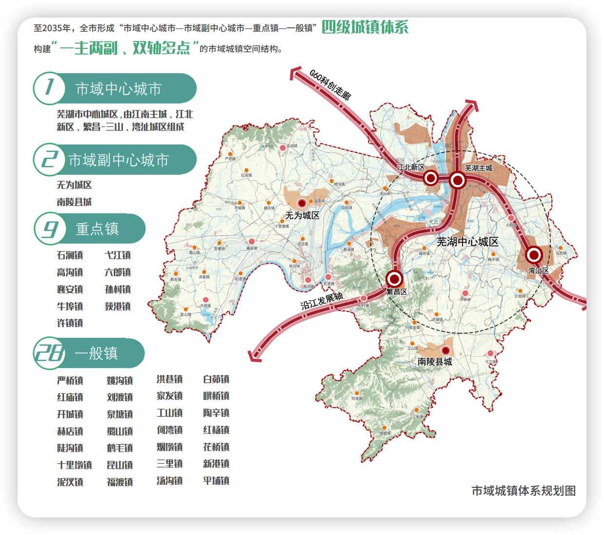
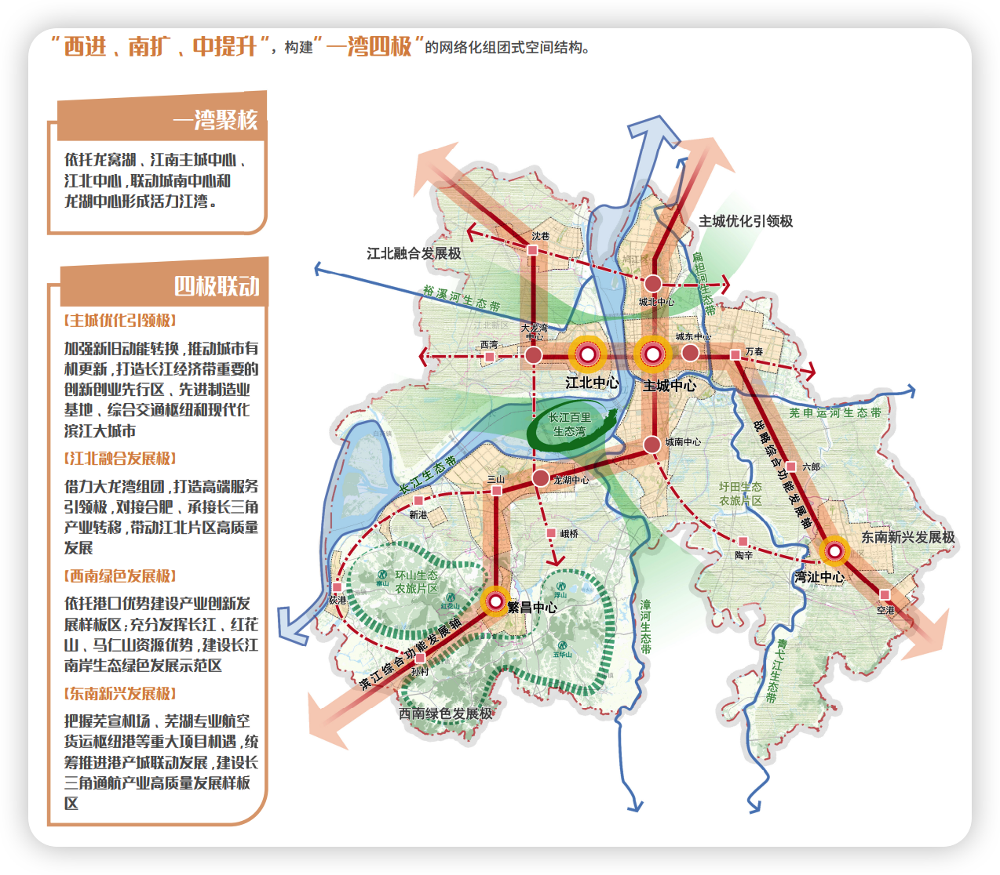

# 规划

## 芜湖市国土空间总体规划(2021-2035年)

原文:[《芜湖市国土空间总体规划（2021-2035年）》](https://www.wuhu.gov.cn/xwzx/tzgg/36626811.html)

### 建设省域副中心

突出芜湖高能级产业基地、高水平综合枢纽以及高品质服务中心功能建设

### 融入新发展格局

- 加速融入长三角一体化 
- 联动构建“宁合芜”金三角
- 辐射带动皖南地区

### 优化国土空间布局

### 保障农业空间

- 无为西部低山丘陵林特产产业带
- 繁昌南陵南部低山丘陵林特产业带
- 沿江现代生态渔业先行带
- 绿色都市农业发展区
- 江北粮油水产区
- 江南粮油种植区
- 江南优质蔬菜瓜果产业区
- 江北优质蔬菜瓜果重点发展区

### 保护生态环境

### 优化城镇空间

### 弘扬文化自信

### 提升空间品质

### 强化支撑体系

### 完善治理机制

